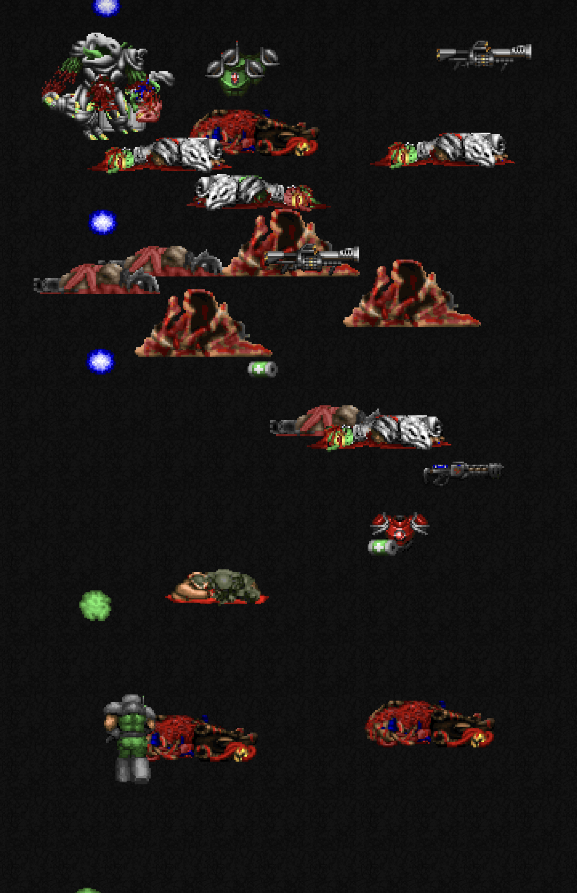
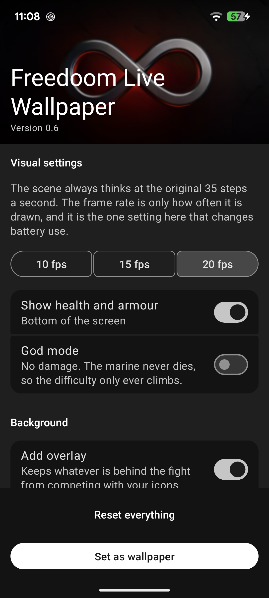

# Freedoom Live Wallpaper

An Android live wallpaper: an endless battle on your home screen. Free, no ads, no
permissions, no network access, nothing collected.

Free is a condition, not a stance: the engine source this borrows from is published "for your
non-profit use", so this application carries no advertising, no paid version and no purchases,
and neither may anything derived from it. See [NOTICE.md](NOTICE.md).

| The wallpaper | The settings |
|---|---|
|  |  |

## What it is built from

**Artwork: [Freedoom](https://github.com/freedoom/freedoom)** (3-clause BSD, per their
`COPYING.adoc`; contributors listed in their `CREDITS` files). Everything drawn on screen is
theirs; this application composes it and adds no artwork of its own. Freedoom is a complete
free game in its own right: <https://freedoom.github.io>. The APK carries 639 of the 3610
lumps in **Phase 2, version 0.13.0** — nothing added, nothing altered, the unused omitted:

| Lumps | Used for |
|---|---|
| `POSS` `SPOS` `CPOS` `TROO` `SARG` `HEAD` `BOSS` `BOS2` `SKUL` `SPID` `BSPI` `CYBR` `FATT` `SKEL` | The fourteen creatures, in every rotation, with the mirrored frames |
| `PLAY` | The marine, walking, firing, in pain and dying |
| `BAL1` `BAL7` `MISL` `PLSS` `APLS` `MANF` `FATB` | Fireballs, rockets and plasma in flight, and their impacts |
| `BLUD` `TFOG` | Blood, and the fog a creature arrives in |
| `MEDI` `STIM` `ARM1` `ARM2` `SHOT` `SGN2` `MGUN` `LAUN` `PLAS` | Supply drops, and the weapons left on the ground |
| Flats between `F_START` and `F_END` | The dungeon floor, chosen by measuring the lightness and saturation of the WAD's own flats |
| `PLAYPAL` | The palette — every colour on screen, including the red wash on death and the green one on winning |
| `STTNUM0`–`9` | The health and armour numerals |
| `FREEDOOM` | Their identifying lump, kept so the subset stays recognisable as theirs |

**Behaviour: [id-Software/DOOM](https://github.com/id-Software/DOOM)** (GPL-2.0, rights held
by ZeniMax Media Inc.), the engine source release — which is why this application is GPL-2.0
too, and why it is free. No code was copied: the constants and algorithms were reimplemented
in Kotlin, each carrying a comment naming the file and symbol it came from. What was taken:

| Source | Used for |
|---|---|
| `info.c` | `mobjinfo`: speed, health, radius, pain chance. `states`: sprite, frame and tic count for every animation step |
| `p_enemy.c` | `P_NewChaseDir` and the `xspeed`/`yspeed` direction tables; `P_TryWalk`'s random `movecount`; `P_CheckMissileRange` |
| `m_random.c` | The 256-byte `rndtable` and its advancing index |
| `p_mobj.c` | 16.16 fixed-point movement, friction, stop speed |
| `p_inter.c` | Armour absorption and how damage is applied |
| `p_pspr.c` | The weapon damage formulas |
| `p_map.c` | `PIT_CheckThing`'s missile damage multiplier |
| `g_game.c` | The five skill levels and their flags |
| `r_things.c` | Sprite rotation selection and mirrored frames |

Neither project is affiliated with this one, endorses it, or is involved in it.

## What it does

- **Fourteen creatures** with the speeds, states, animation lengths and health `info.c` gives
  them, and `P_NewChaseDir` reproduced from the source: table-based movement, no trigonometry.
  This is why they move like the original creatures rather than like something chasing a point.
- **Twenty-six waves and nine skill levels** — the five from `g_game.c` with four of ours
  between them, each fitted by measurement rather than by feel. The easiest reaches the first
  boss 99 times in 100; Nightmare is a wall by construction.
- **Combat**: melee, hitscan, missiles, pain, death, corpses. Missile damage goes through
  `PIT_CheckThing`'s multiplier, so a rocket is a rocket.
- **Your own sprites**: point it at any IWAD you already own and its sprites, palette, floors
  and numerals replace the bundled ones. The file is copied into the app and never leaves the
  device. No WAD is downloaded by this app, and none is linked from it.
- **Backgrounds** chosen by measuring the WAD's own flats — colour family, then saturation —
  or a flat palette colour, or a photograph of yours.
- **Tap** the home screen to drop a supply crate; **drop an icon** to spawn attackers there.

The scene always thinks at the original 35 tics a second. The frame rate is only how often it
is drawn, and it is a setting.

## Battery

The claim a live wallpaper has to answer. Thirteen hours unplugged, screen on for 100% of it,
this wallpaper active throughout, read from `batterystats` per uid:

| | mAh | share of the drain |
|---|---:|---:|
| Whole device | 2360 | |
| The screen | 486 | 20.6% |
| **This wallpaper** | **116** | **4.9%** |

**9.0 mA — 0.23% of a 4006 mAh battery per hour**, against a 2% target. An independent check
from `/proc/<pid>/stat` over the same period gives 12.7% of one core, matching the sixty-second
samples taken months earlier. A second method that bounds the same number from above puts the
ceiling at 0.93%/hour; the honest claim is the range. Hidden — any full-screen app, the screen
off — it costs **zero measured CPU ticks**.

## Where the idea comes from

Back in 2011, **James Gittins** put the fight itself on your home screen — the marine, the
monsters, the sprites anyone who had played it knew on sight — and a lot of us left it running
there for years. It cannot be installed on a modern Android any more: it targets an API level
the system now refuses, so at some point you upgrade your phone and it is simply gone.

This is not a port or a revival. No code and no asset is shared, everything here was written
from nothing, and the artwork is Freedoom's — which is what makes this one free to pass on.
What carried over is the idea, and a good idea deserves to still work on the phone you
actually have. Thanks, James.

## Install

A signed APK is attached to each [release](../../releases). Android will ask you to allow
installing from outside the store; that is expected for an app distributed this way.

After installing, open it and use **Set as wallpaper**, or go to
*Settings → Wallpaper → Live wallpapers*.

Requires Android 12 or newer.

## Build from source

1. Install Android Studio (it bundles the JDK, SDK, Gradle and adb):
   ```
   winget install --id Google.AndroidStudio -e
   ```
   On first launch: **Standard** setup wizard, then *SDK Manager → SDK Platforms* → tick
   **Android 16 (API 36)**.

2. Put `adb` on the PATH; it is needed for the battery measurements:
   ```
   winget install --id Google.PlatformTools -e
   ```

3. Download Freedoom from <https://freedoom.github.io>, put its `freedoom2.wad` at
   `app/wad/freedoom-full.wad`, and run:
   ```
   gradlew reduceWad
   ```
   That writes `app/src/main/assets/freedoom2.wad` containing only the lumps the wallpaper
   reads — 639 of 3610, 1.9 MB instead of 27.5 MB. Neither file is in the repository (see
   `.gitignore`), and the input stays outside `assets` so it is never packaged.

   **Phase 2, not Phase 1.** Freedoom Phase 1 carries nine of the
   fourteen creatures this bestiary names; the five it lacks — the ChaingunZombie,
   BoneStalker, LesserLord, Spiderling and Bloater — were being substituted away at runtime,
   so the shipped wallpaper never showed a third of its own table. The balance measurements
   were taken with every creature present, which meant they described a file nobody had.
   Phase 2 has all fourteen. It costs 496 KB more in the APK.

4. Open the folder in Android Studio and run it on a physical phone, then go to
   *Settings → Wallpaper → Live wallpapers* and pick it.

The emulator works for rendering but is not representative of power consumption. `gradlew test`
runs 53 JVM tests, including an hour-long simulation that pins the top of the skill ladder;
none of them launches the app.

## Licences

- Assets: **Freedoom**, 3-clause BSD licence.
- Code: **GPL-2.0**, by obligation rather than preference — see what it is built from, above.
  The comments naming each constant's origin are the attribution the licence requires and
  must not be removed. Full texts in [NOTICE.md](NOTICE.md).
- No commercial asset is redistributed here in any form. Users may point the app at an IWAD
  they legally own; nothing of the kind is bundled with the app, downloaded by it, or linked
  from it.

Privacy policy: [PRIVACY.md](PRIVACY.md). It is short.
